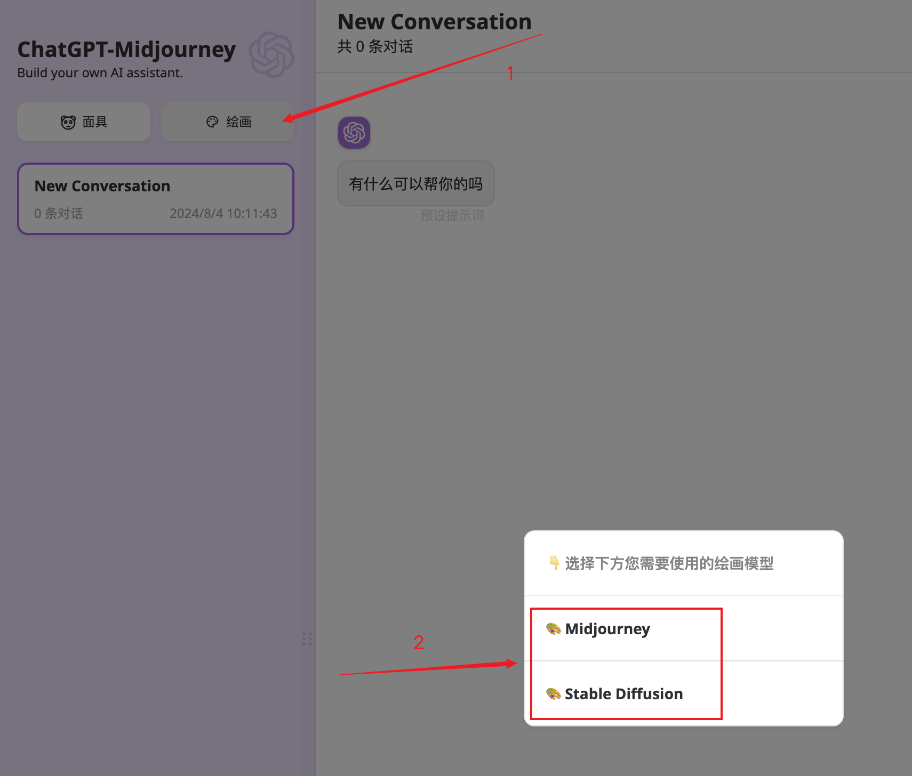
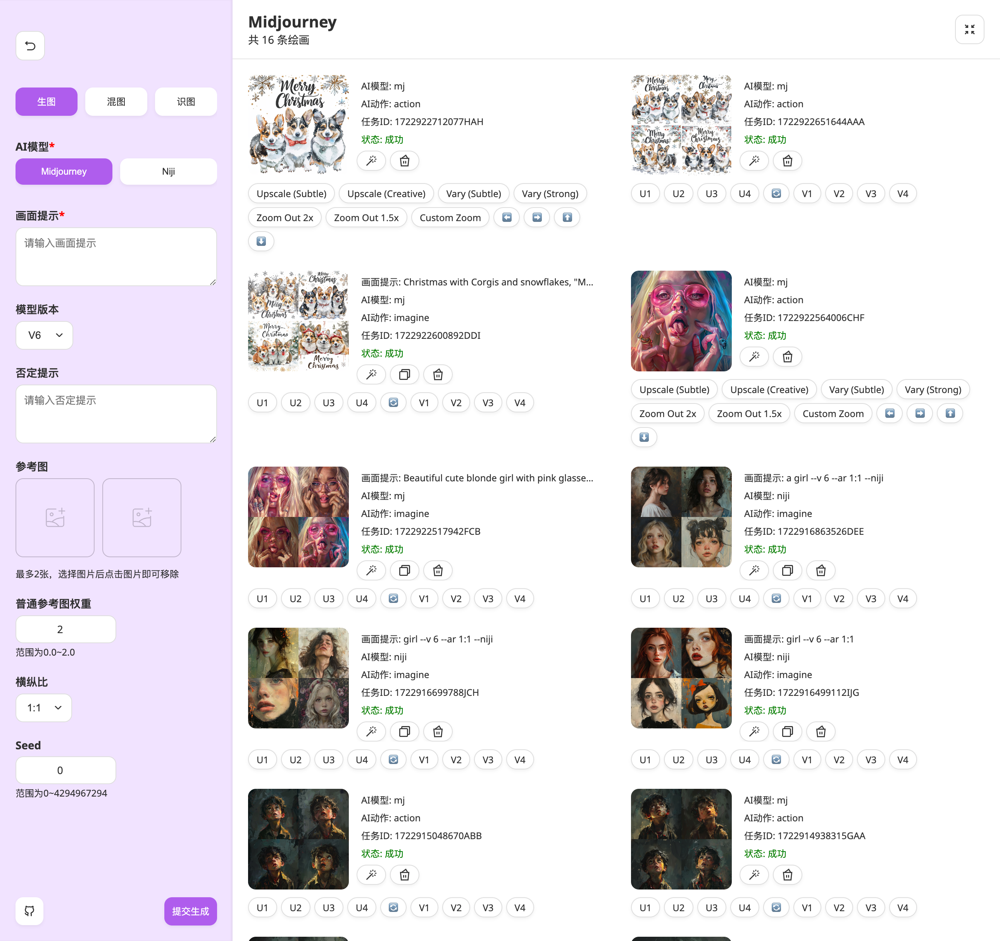
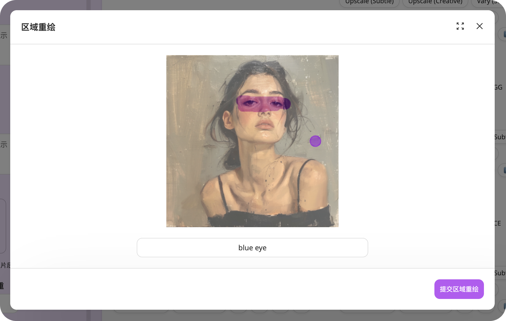
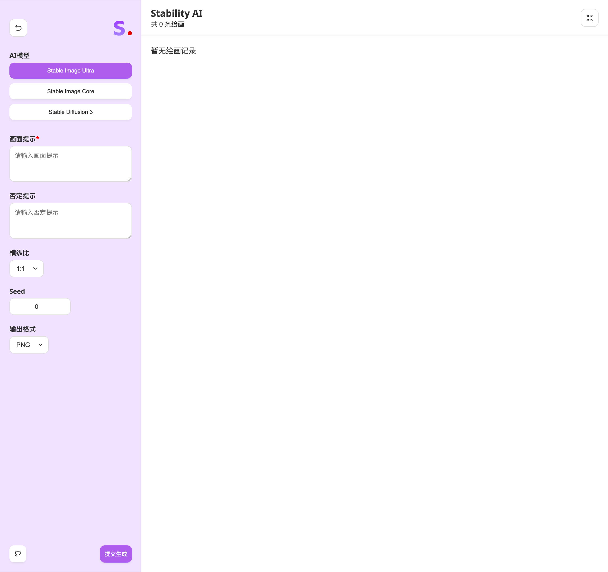
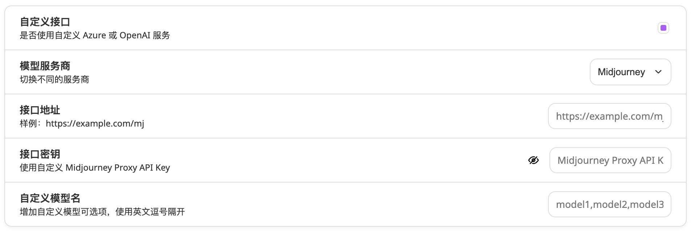

<div align="center">

<h1 align="center">🌻 ChatAny</h1>

中文 | [English](./README_EN.md)

一键拥有你自己的 `ChatGPT`+`众多AI` 的聚合网页服务（基于[ChatGPT-Next-Web](https://github.com/ChatGPTNextWeb/ChatGPT-Next-Web)开发）

[QQ交流群](https://github.com/ChatAnyTeam/ChatAny/issues/30) | [💥PRO版本](https://github.com/Licoy/GoAmzAI)

[](https://github.com/Licoy/wordpress-theme-puock)


</div>

## 功能支持
> 🍭 PRO版本支持更强大的功能：
> - 最低1C1G的服务器就能流畅运行
> - 宝塔极速可视化部署、配置简单易懂
> - 站点完全自适应支持PC、平板、手机
> - 低内存占用，Golang开发原生高并发支持
> - 包含AI对话、AI绘画、AI音乐、AI视频、AI生成PPT、PDF解析对话、AI应用支持等众多AI模块
> - 具有非常完善的运营机制，包括但不限于套餐系统、兑换码系统、邀请奖励、签到福利、推广返利等等
> - [🫱 点我立即了解及体验PRO版本](https://github.com/Licoy/GoAmzAI)

### 已支持
- [x] 原`ChatGPT-Next-Web`所有功能
- [x] StabilityAI
  - [x] 支持 Stable Image Ultra
  - [x] 支持 Stable Image Core
  - [x] 支持 Stable Diffusion 3
- [x] Midjourney `(非官方)`
  - [x] Midjourney `Imgine` `Upscale`  `Variation`  `Zoom`  `Vary`  `Pan`  `Reroll`  `Describe`  `Blend` 等众多操作，完美支持 Midjourney 图像生成之后的任何操作
  - [x] Midjourney 区域重绘（Vary Region）支持
  - [x] Midjourney 参考图片
  - [x] 绘图进度百分比、实时图像显示

## MidjourneyAPI说明
> 本项目Midjourney相关API接口采用以下开源项目或同类项目提供API生成能力支持，使用本项目之前您需要先自建此服务，或者使用第三方中转平台的API。

### 开源Midjourney-Proxy
- 项目地址：[trueai-org/midjourney-proxy](https://github.com/trueai-org/midjourney-proxy)

## 参数说明
### `MJ_PROXY_URL`
MJ Proxy的API链接地址
### `MJ_PROXY_KEY`
MJ Proxy的API密钥
### `CODE`
（可选）设置页面中的访问密码
### `...其余参数`
与 ChatGPT-Next-Web 一致

## 部署
### Docker
```shell
docker run -d -p 3000:3000 \
   -e OPENAI_API_KEY="sk-xxx" \
   -e BASE_URL="https://api.openai.com" \
   -e MJ_PROXY_URL="" \
   -e MJ_PROXY_KEY="" \
   licoy/chatany:latest
```
### Vercel
[](https://vercel.com/new/clone?repository-url=https%3A%2F%2Fgithub.com%2FChatAnyTeam%2FChatAny&env=OPENAI_API_KEY&env=MJ_PROXY_URL&env=MJ_PROXY_KEY&env=CODE&project-name=chat-any&repository-name=ChatAny)
### Railway
[](https://railway.app/template/1g6vDL?referralCode=vvEj-K)
### Sealos
[](https://cloud.sealos.io/?openapp=system-template%3FtemplateName%3Dchatany)
### 手动部署
- clone本项目到本地
- 安装依赖
```shell
npm install
npm run build
npm run start // #或者开发模式启动： npm run dev
```
## 使用
### 创建绘画
部署好后，点击左上方的绘画，选择您需要使用的绘画模型即可进入：

## 截图
### Midjourney生成主界面

### Midjourney区域重绘

### StabilityAI生成主界面

### 自定义配置接口

### 更多功能
等你自行发掘

## 第三方中转API
> 以下为第三方中转API，本项目不做任何担保，请自行选择使用，若遇到任何疑问请联系对应的平台客服。

[](https://goapi.gptnb.ai)

[](https://api.mjdjourney.cn)


## 开源协议
[MIT](./LICENSE)
