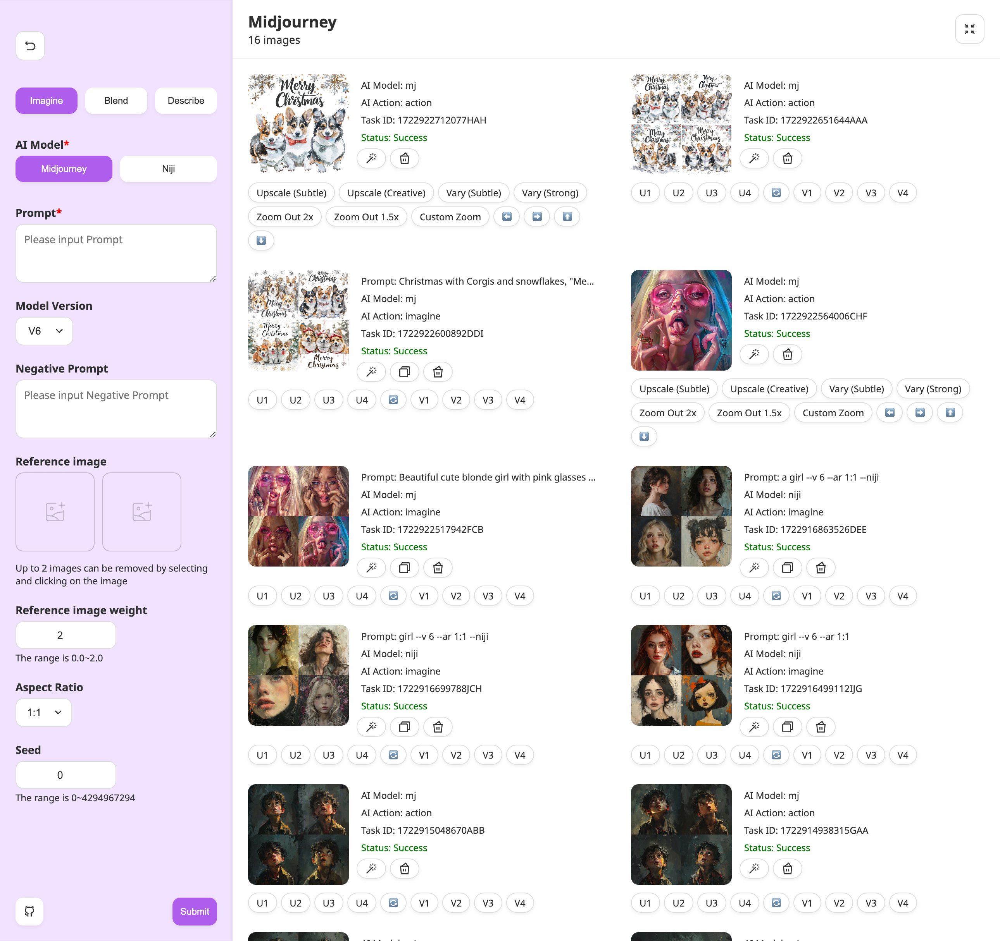
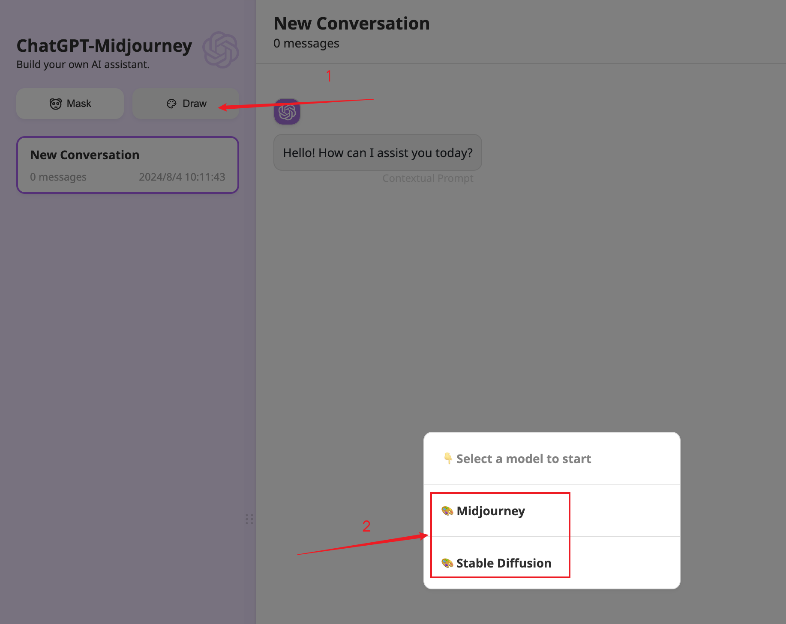
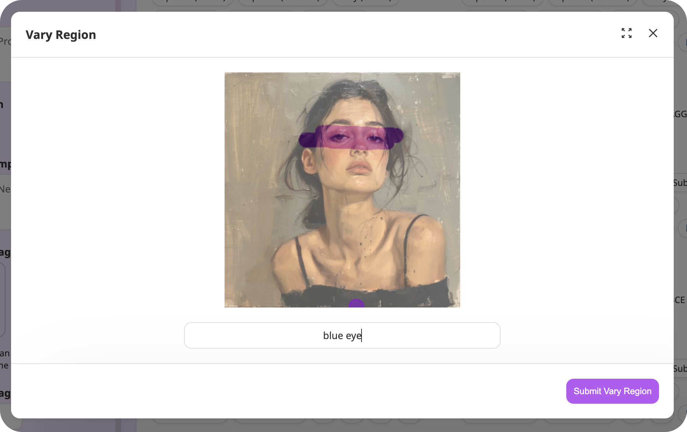
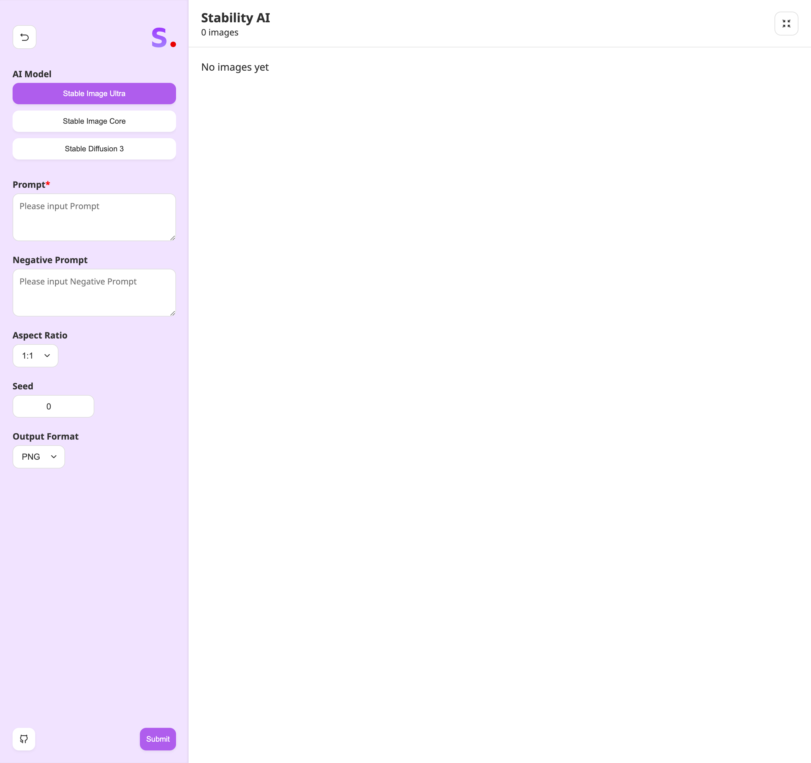
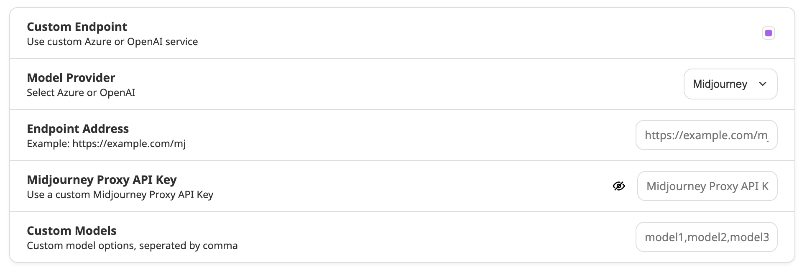

<div align="center">

<h1 align="center">🍭 ChatGPT-Midjourney</h1>

[中文](./README.md) | English

One-click to own your own ChatGPT+StabilityAI+Midjourney web service (based on [ChatGPT-Next-Web](https://github.com/ChatGPTNextWeb/ChatGPT-Next-Web) development)

[QQ Exchange Group](https://github.com/Licoy/ChatGPT-Midjourney/issues/30) | [💥PRO VERSION](https://github.com/Licoy/GoAmzAI)

[](https://github.com/Licoy/wordpress-theme-puock)



</div>

## Function support
> 🍭 PRO version supports more powerful functions:
> - Servers with a minimum of 1C1G can run smoothly
> - Baota's extremely fast visual deployment and easy-to-understand configuration
> - The site is fully adaptive and supports PC, tablet, and mobile phones
> - Low memory usage, Golang development native high concurrency support
> - Contains many AI modules such as AI dialogue, AI painting, AI music, AI video, AI generated PPT, PDF parsing dialogue, AI application support, etc.
> - Has a very complete operating mechanism, including but not limited to package system, redemption code system, invitation rewards, sign-in benefits, promotion rebates, etc.
> - [🫱 Click me to learn and experience the PRO version immediately](https://github.com/Licoy/GoAmzAI)

### Already supported
- [x] All functions of the original `ChatGPT-Next-Web`
- [x] Midjourney `Imgine` `Upscale` `Variation` `Zoom` `Vary` `Pan` `Reroll` `Describe` `Blend` and many other operations, perfect support for any operation after Midjourney image generation
- [x] Midjourney Vary Region Support
- [x] Midjourney reference image
- [x] Drawing progress percentage, real-time image display
- [x] Support Stable Image Ultra
- [x] Support Stable Image Core
- [x] Support Stable Diffusion 3

## MJ Proxy API support
> The Midjourney-related API capabilities of this project are supported by the [trueai-org/midjourney-proxy](https://github.com/trueai-org/midjourney-proxy) open source project or similar projects. Before using this project, you need to build this service yourself or use the API of a third-party transit platform.

### Midjourney-Proxy
- Project address: [trueai-org/midjourney-proxy](https://github.com/trueai-org/midjourney-proxy)
- Supported systems: Linux / Windows / MacOS
- Deployment method: Docker, one-click script, installation package, etc.

### Third-party transfer API
> The following is a third-party transfer API. This project does not provide any guarantee. Please choose to use it by yourself. If you encounter any questions, please contact the corresponding platform customer service.

[](https://goapi.gptnb.ai)

[](https://api.mjdjourney.cn)

## Parameter Description
### `MJ_PROXY_URL`
MJ Proxy API link address
### `MJ_PROXY_KEY`
MJ Proxy API key
### `CODE`
(Optional) Set the access password on the page
### `...Other parameters`
Same as ChatGPT-Next-Web

## Deployment
### Docker
```shell
docker run -d -p 3000:3000 \
-e OPENAI_API_KEY="sk-xxx" \
-e BASE_URL="https://api.openai.com" \
-e MJ_PROXY_URL="" \
-e MJ_PROXY_KEY="" \ licoy/chatgpt-midjourney:latest
```
### Vercel
[](https://vercel.com/new/clone?repository-url=https%3A%2F%2Fgithub.com%2FLicoy%2FChatGPT-Midjourney&env=OPENAI_API_KEY&env=MJ_PROXY_URL&env=MJ_PROXY_KEY&env=CODE&project-name=chatgpt-midjourney&repository-name=ChatGPT-Midjourney)
### Railway
[](https://railway.app/template/1g6vDL?referralCode=vvEj-K)
### Sealos
[](https://cloud.sealos.io/?openapp=system-template%3FtemplateName%3Dchatgpt-midjourney)

### Manual deployment
- Clone this project to local
- Install dependencies
```shell
npm install
npm run build
npm run start // #Or start in development mode: npm run dev
```
## Use
### Create a painting
After deployment, click the painting in the upper left corner and select the painting model you need to use to enter:

## Screenshots
### Midjourney generates the main interface

### Midjourney Vary Region

### StabilityAI generates the main interface

### Custom configuration interface

### More features
Waiting for you to discover

## Open source agreement
[MIT](./LICENSE)