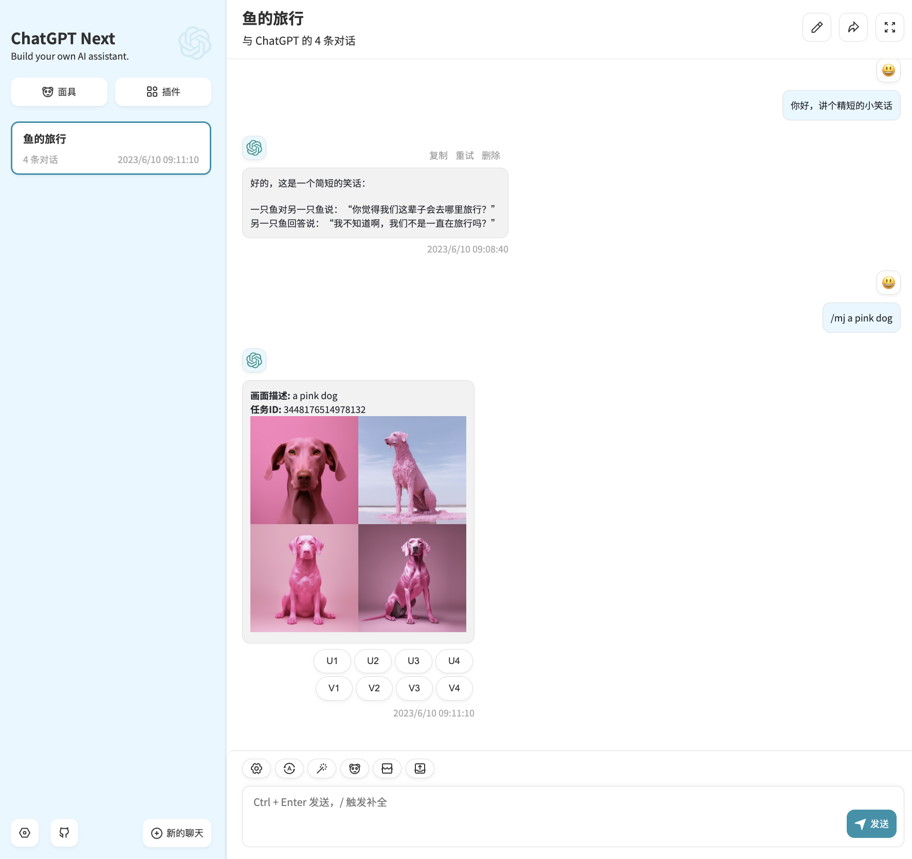
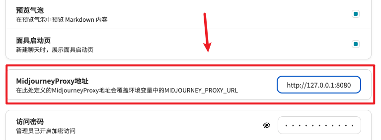
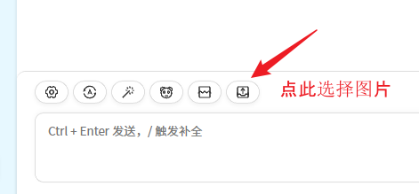
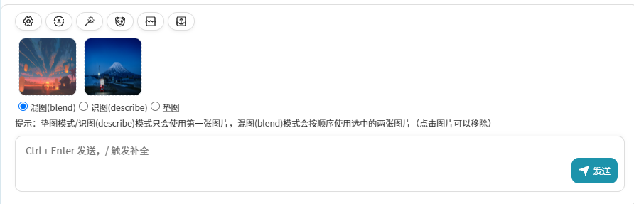
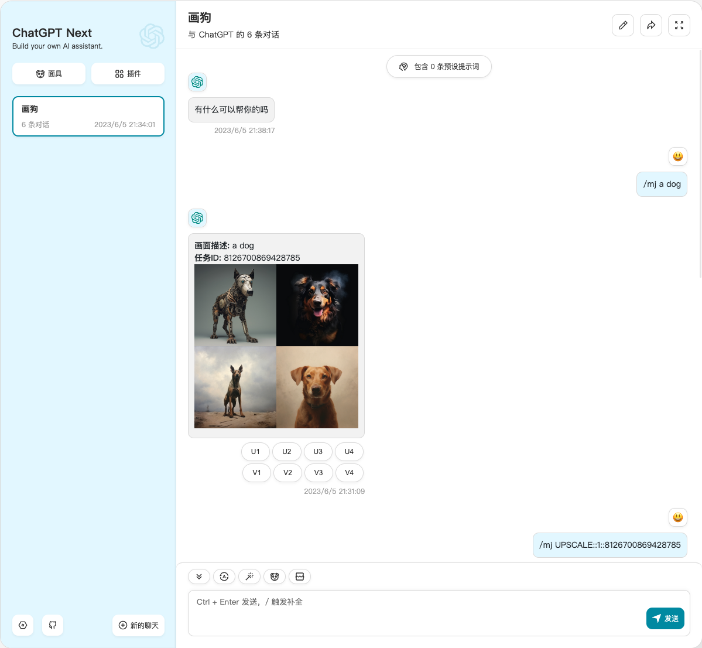
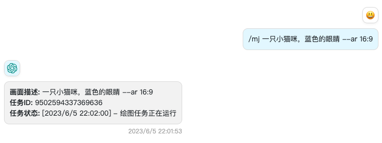

<div align="center">

<h1 align="center">ChatGPT-Midjourney</h1>

[中文](./README.md) | [English](./README_EN.md) | 日本語

プライベート ChatGPT + Midjourney ウェブアプリケーションをワンクリックで無料デプロイ（[ChatGPT-Next-Web](https://github.com/Yidadaa/ChatGPT-Next-Web) 開発をベースにしています）

[QQ グループ](http://qm.qq.com/cgi-bin/qm/qr?_wv=1027&k=gAGpNxOKdRB3L_IiHWAfT4MUQzgBOor-&authKey=Ty8WQgZFub8W1EsG3LQE2B3xxRRBzD0Rj1rPyRVFdT6IqnJgGcpPZB5l8ZVJTB1n&noverify=0&group_code=849273126) | [Telegram](https://t.me/gptmj)

[](https://vercel.com/new/clone?repository-url=https%3A%2F%2Fgithub.com%2FLicoy%2FChatGPT-Midjourney&env=OPENAI_API_KEY&env=MIDJOURNEY_PROXY_URL&env=CODE&project-name=chatgpt-midjourney&repository-name=ChatGPT-Midjourney)
[](https://github.com/novicezk/midjourney-proxy/blob/main/docs/railway-start.md)



</div>

## サポート
- [x] オリジナルの `ChatGPT-Next-Web` の全機能を搭載
- [x] midjourney `imagine`
- [x] midjourney `upscale` ズームイン
- [x] midjourney `variation`
- [x] midjourney `describe`
- [x] midjourney `blend`
- [x] midjourney パッドフィギュア
- [x] 描画の進捗率、ライブイメージの表示
- [ ] midjournal API を単体でサポート

## パラメータ説明
### MIDJOURNEY_PROXY_URL
```shell
MIDJOURNEY_PROXY_URL=http://yourip:port
```
> ⚠️ 注意: Docker デプロイを使用している場合、ここでのアドレスは `http://localhost:port` ではなく、`http://public IP:port` とすべきです。Docker のコンテナは隔離されているので、`localhost` はホストのアドレスではなく、コンテナ内部のアドレスを指しています。
- インターフェイスにて。



### MIDJOURNEY_PROXY_API_SECRET
(オプション) 他者からの悪意ある呼び出しを防ぐため、`midjourney-proxy` の API リクエストキーを環境変数で設定することができる。

### CODE
(オプション) 他人が簡単に残高を消費できないように、ページにアクセスパスワードを設定します

## デプロイ
### ChatGPT-Midjourney フロントエンドデプロイ
#### Docker
```shell
docker run -d -p 3000:3000 \
    -e OPENAI_API_KEY="sk-xxx" \
    -e CODE="123456" \
    -e BASE_URL="https://api.openai.com" \
    -e MIDJOURNEY_PROXY_URL="http://ip:port" \
    licoy/chatgpt-midjourney:v1.3.5
```
#### Vercel
[](https://vercel.com/new/clone?repository-url=https%3A%2F%2Fgithub.com%2FLicoy%2FChatGPT-Midjourney&env=OPENAI_API_KEY&env=MIDJOURNEY_PROXY_URL&env=CODE&project-name=chatgpt-midjourney&repository-name=ChatGPT-Midjourney)
#### 手動デプロイ
- このプロジェクトをローカルにクローンする
- 依存関係をインストールする
```shell
npm install
npm run build
npm run start // #または開発モードで起動: npm run dev
```
### midjourney-proxy サービスデプロイ
#### Docker
- `midjourney-proxy` を実行する (Midjourney API サービス。パラメータの詳細な設定については、以下を参照してください: [midjourney-proxy](https://github.com/novicezk/midjourney-proxy))
```shell
docker run -d --name midjourney-proxy \
  -p 8080:8080 \
  -e mj.discord.guild-id=xxx \
  -e mj.discord.channel-id=xxx \
  -e mj.discord.user-token=xxx\
  -e mj.discord.bot-token=xxx\
  --restart=always \
  novicezk/midjourney-proxy:2.2.3
```
#### Railway
> Railway は、柔軟な展開ソリューションを提供するプラットフォームです。サービスは海外にあり、MidJourney が call するのに便利です。

参考: [midjourney-proxy - Railway デプロイチュートリアル](https://github.com/novicezk/midjourney-proxy/blob/main/docs/railway-start.md)


## 使用
入力ボックスに `/mj` で始まる絵画の説明を入力すると、例えば次のような絵画が作成されます:
```
/mj a dog
```
### 画像の混合、画像の認識、画像のマット化

> ヒント: パッドモード/描写モードは1枚目の写真のみを使用し、ブレンドモードは選択した 2 枚の写真を順番に使用します（写真をクリックすると削除されます）

## スクリーンショット
### 画像の混合、画像の認識、画像のマット化

### ステータスのリアルタイム取得

### カスタム midjourney パラメータ

### その他の機能
- あなたの発見を待っています

## 謝辞
- [ChatGPT-Next-Web](https://github.com/Yidadaa/ChatGPT-Next-Web)
- [midjourney-proxy](https://github.com/novicezk/midjourney-proxy)

## オープンソース規約
[Anti 996 LICENSE](./LICENSE)
